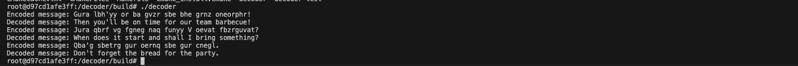
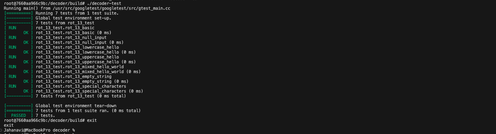

# Decoder

This project builds and runs a C/C++ decoder application along with unit tests using Docker and Docker Compose.

---


## Prerequisites

- [Docker](https://www.docker.com/)
- [Docker Compose](https://docs.docker.com/compose/)

---

## Clone the Repository

 Cloning this repository to your local machine

```bash
git clone https://github.com/yourusername/decoder.git
cd decoder
```

## Build the Project

To build the Docker image from scratch:

```bash
docker compose build --no-cache
```

To run the decoder and decoder-test 

```bash
docker compose up  --force-recreate
```

To stop and remove all containers

```bash
docker compose down --remove-orphans
```

---
### Result 
decoder and decoder test output should look like this 



Decoder test

